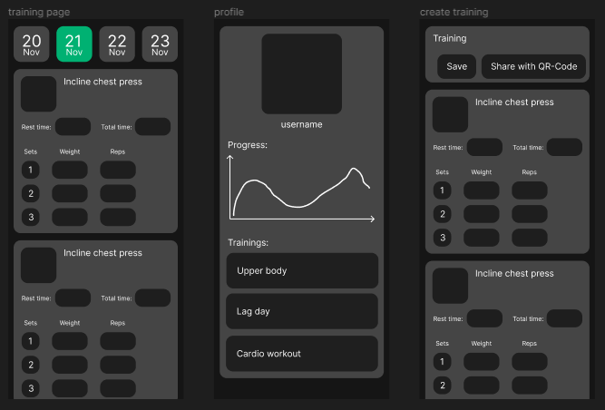

# Train-it

Eine einfache App, mit der man schnell und einfach sein Training nachverfolgen kann. Der Schwerpunkt liegt dabei auf der Verfolgung des täglichen Trainings mit der Möglichkeit, den Fortschritt anhand von Diagrammen und Statistiken zu verfolgen. Zu den weiteren Funktionen gehört die Möglichkeit, Daten im CSV/JSON-Format zu importieren und zu exportieren. Man kann auch eigene Workouts erstellen, indem man Übungen hinzufügt, die nicht in der Datenbank enthalten sind. Die App ermöglicht außerdem, deine erstellten Workouts über einen QR-Code mit Freunden zu teilen.

<!-- [Cookbook: Useful Flutter samples](https://docs.flutter.dev/cookbook) -->

## Designs

<!-- Figma: https://www.figma.com/file/xrvLcwp6iHUNI0zAYaKgMo/Train-it?type=design&node-id=0-1&mode=design&t=e5X3HbQAkbZM7qji-0 -->

